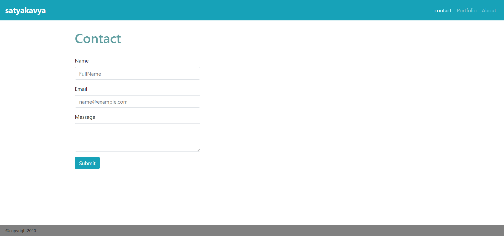

# MyPortfolio.github.io
My Responsive portfolio

# Application Does:
* Responsive Portfolio using Bootstrap.

# Technologies used:
* HTML, CSS, Bootstrap

# Features:
* validations.
* FullName, Email Id are mandatory.
* Email Id needs to be entered in correct format.
* Responsive images.
* Navbar consistent on each page.
* sticky footer
* Google Fonts

# Challenges:
* Page Alignment (Tip:Follow Grid rules)
* Validators 

# Sample web page

# Github Page 

# Github Repository

copyright 2020