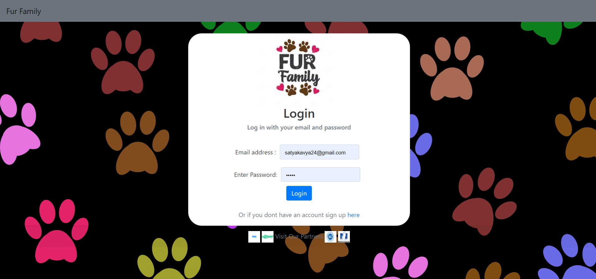
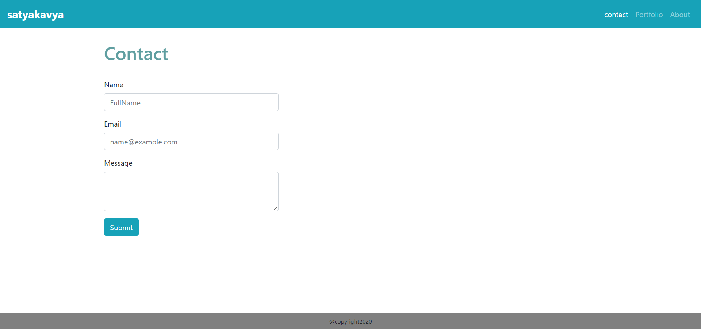
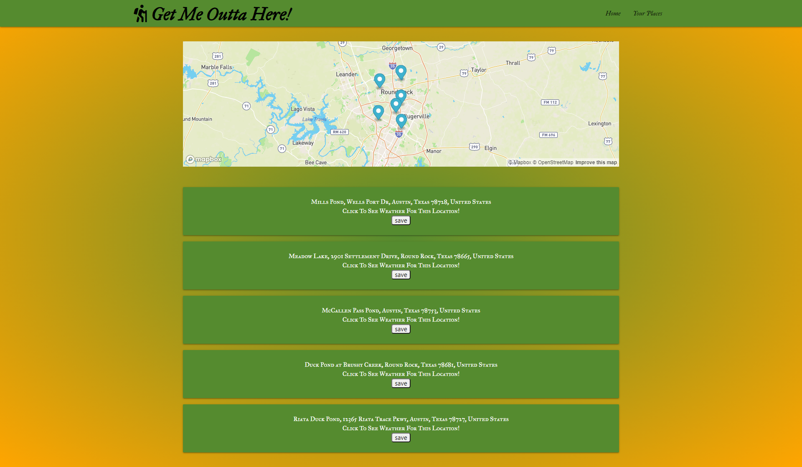
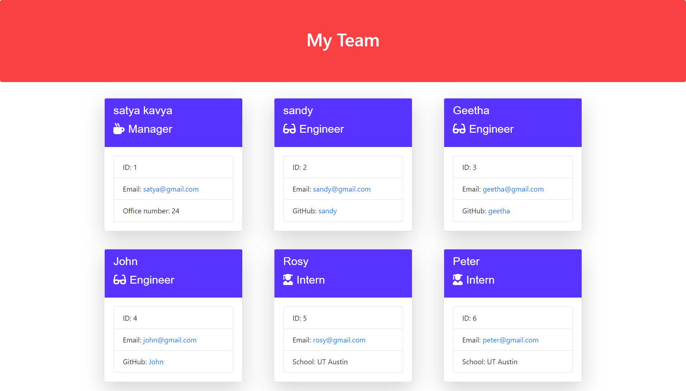

# Application Does:
* Responsive Portfolio

# Technologies used:
* HTML, CSS, Bootstrap

# Features:
* validations.
* FullName, Email Id are mandatory.
* Email Id needs to be entered in correct format.
* Responsive images.
* Navbar consistent on each page.
* sticky footer
* Google Fonts
* Responsive Layout
* Projects Github and Heroku Links
* Projects Screenshots
* Resume, Github and LinkedIn Links

# Challenges:
* Page Alignment (Tip:Follow Grid rules)
* Validators 

# Sample web page

# Github Page 
https://vsatyakavya.github.io/MyPortfolio.github.io/

# Github Repository

https://github.com/vsatyakavya/MyPortfolio.github.io

# Contact 
satyakavya24@gmail.com

copyright 2020
